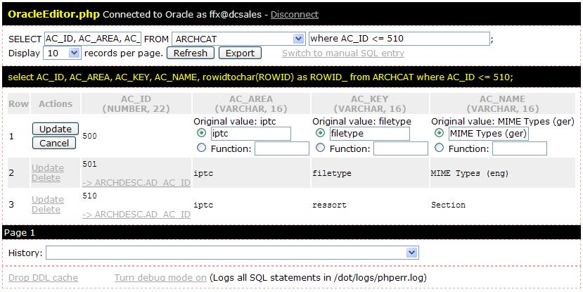

OracleEditor.php
================

**OracleEditor.php** is a standalone PHP script which allows you to **browse your Oracle database tables and insert, update and delete rows in any table**. It requires **no installation** and **no configuration**.

I wrote it for situations where you quickly need to do some small data manipulation and don’t have a better tool available. OracleEditor.php is free and Open Source. Feel free to contact me with questions/comments specific to this script. For general information on using PHP with Oracle, please refer to the [Oracle Technology Network](http://www.oracle.com/technetwork/topics/php/whatsnew/index.html) or the [PHP manual](http://www.php.net/manual/en/ref.oci8.php).

Disclaimer
----------

Use this software at your own risk. I won’t guarantee that it works, and I won’t be held liable for any damage caused by it! Please make sure to **protect this script with a .htaccess password or the like** - never ever allow public access to it. Anyone capable of guessing your database login will be able to cause severe damage to your database.

Download
--------

Simply download the OracleEditor.php file and copy it on your web server.

Requirements
------------

You need a webserver running PHP 4 (version 4.1 or greater) with Session and OCI8 support. OracleEditor.php works fine with the php.ini setting register_globals=off.

Features

* Connects to any Oracle database (local databases, aliases from tnsnames.ora, or complete connection strings)
* Lists all tables and views owned by the user, and those owned by other users where access has been granted
* Simply select a table or view to display (SELECT) its records
* Modify the list of fields to select (optional)
* Add a WHERE clause (optional)
* Records are displayed in sets, allowing you to browse huge tables
* Foreign key values are linked to the master record: Simply click on the value to display the master record
* Fields which are used as foreign keys in other tables have links allowing you to browse all child records with one click
* Last 25 SELECT statements are in the History popup
* Exports your result set as an HTML, XML or CSV file
* UPDATE, DELETE, and INSERT rows in any table
* When updating or inserting, field values can either be strings or function names (allowing you to insert sequencer values, function calls, or NULL)
* String values are sent to Oracle as bound variables, so that you don’t have to escape single quotes
* When inserting, nullable fields are pre-set to NULL so that you know which fields can be left blank
* Optional free SQL statement entry
* Debug mode logs all SQL statements in the PHP error_log
* Oracle error messages are displayed so that you know what went wrong
* Works with register_globals=off, and with both magic_quotes_gpc=on or magic_quotes_gpc=off
